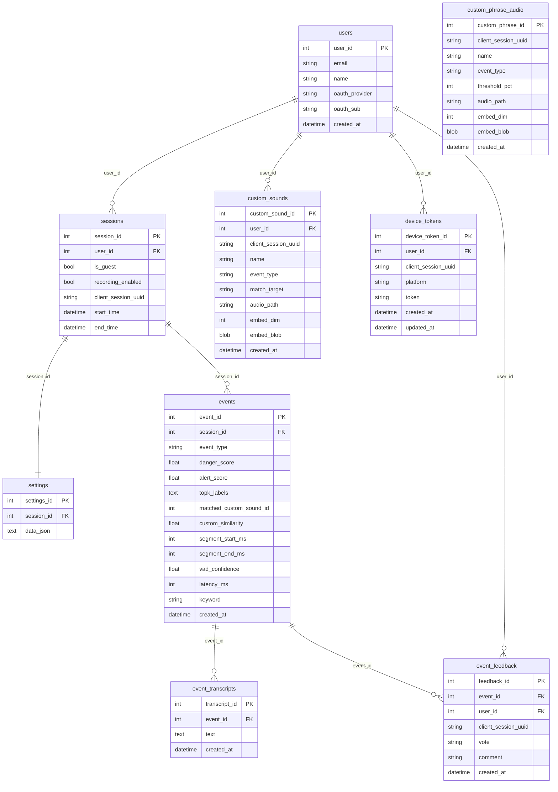

# Underdog DB ERD

SQLAlchemy 모델 기준: `Backend/App/db/models.py`  
SQLite: `Backend/data/underdog.db` (배포 환경에 따라 경로 상이할 수 있음)

## 관계 요약

- **User** — 선택적으로 여러 **Session**, **CustomSound**, **EventFeedback**, **DeviceToken**과 연결 (`user_id` nullable인 경우 많음: 게스트·세션 UUID 기반 흐름).
- **Session** — **User**에 속함(optional), **Settings**와 1:1, **Event** 1:N.
- **Event** — **Session**에 속함, **EventTranscript**·**EventFeedback** 1:N.
- **CustomPhraseAudio** / 일부 **CustomSound**·**DeviceToken**은 `client_session_uuid`로 세션과 **논리적**으로만 연결(FK 없음).

아래 다이어그램은 VS Code / GitHub에서 Mermaid로 렌더링됩니다.

## 제약·비관계 필드

| 항목 | 설명 |
|------|------|
| `uq_settings_session_id` | 세션당 설정 1건 |
| `uq_feedback_event_session` | 동일 `(event_id, client_session_uuid)` 피드백 중복 방지 |
| `uq_device_tokens_token` | 토큰 유일 |
| `events.matched_custom_sound_id` | 정수 참조만 있음 ORM FK 아님 |
| `custom_phrase_audio`, `custom_sounds`(일부), `device_tokens` | `client_session_uuid`로 세션과 앱 레벨 매칭 |
